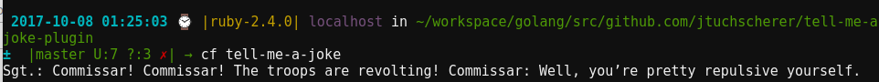

# Tell Me a Joke CF CLI Plugin

[](https://travis-ci.org/jtuchscherer/tell-me-a-joke-plugin)

## Installation
Download the appropriate binary from the [release tab](https://github.com/jtuchscherer/tell-me-a-joke-plugin/releases)
```bash
 cf install-plugin PATH_TO_THE_BINARY

```

## Usage
`cf tell-me-a-joke`

[](./docs/screenshot.png)

## Uninstall

```bash
cf uninstall tell-me-a-joke-plugin
```

## Testing

Run tests
```bash
./scripts/test.sh
```

If you want to install the plugin locally and test it manually
```bash
./scripts/install.sh
```

## Releasing

In order to create a new release, follow these steps

1. Create local tag and binaries
  ```
  ./scripts/build-all.sh release VERSION_NUMBER #(e.g. 0.7.0)
  ```
1. Copy the output of the previous command from the first line (should be '- name: whoami-plugin' to the last checksum line (should be something like checksum: fde5fd52c40ea4c34330426c09c143a76a77a8db)
1. Push the tag `git push --follow-tags`
1. On github, create new release based on new tag [here](https://github.com/jtuchscherer/tell-me-a-joke-plugin/releases/new)
1. Upload the three binaries from the ./bin folders to the release (Linux, OSX and Win64)
1. Fork [this repo](https://github.com/cloudfoundry-incubator/cli-plugin-repo) and clone it locally
1. Edit the repo-index.yml
  ```
  vi repo-index.yml
  ```
  to override the existing section about the whoami plugin with the text previously copied in Step 2.
1. Push the change to your fork
1. Create a PR against the [original repo](https://github.com/cloudfoundry-incubator/cli-plugin-repo/compare)

```
